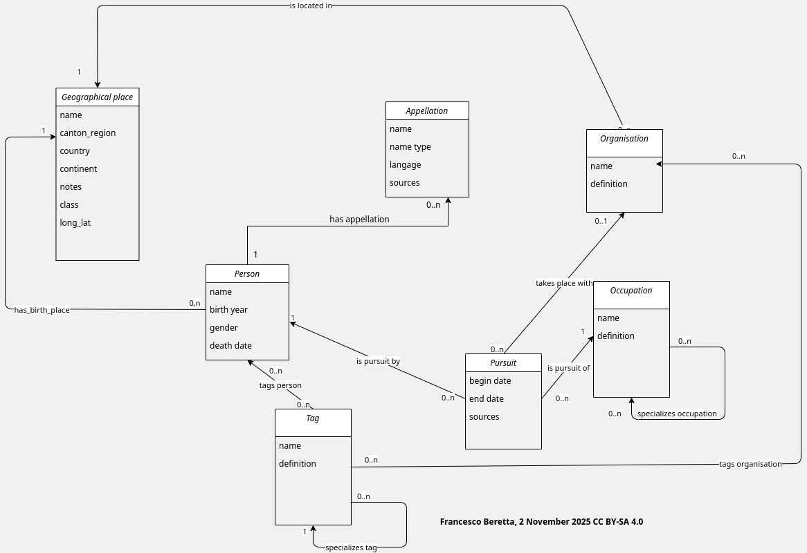

# Personnnalités vaudoises

" A rich database about people notable for special artistical and cultural merits for the Canton of Vaud, “personnalités vaudoises”, including detailed biographical information and many links of various nature. This data stems from the database originally designed in 2006 to celebrate the Rumine Palace centennial." ([Swiss Heritage Data, *Personnalités vaudoises*](https://make.opendata.ch/wiki/data:glam_ch#personnalites_vaudoises))

## Base de données

* [Le site *Personnalités vaudoises* avec fonction de recherche](https://patrinum.ch/search?c=PersonnalitesVD&cc=PersonnalitesVD&ln=fr)
* [Swiss Heritage (Open) Data](https://make.opendata.ch/wiki/data:glam_ch#swiss_heritage_data)
* [Entrée *Personnalités vaudoises*](https://make.opendata.ch/wiki/data:glam_ch#personnalites_vaudoises)
* [Données téléchargeables](https://make.opendata.ch/wiki/_media/data:20170907_persovd.xlsx)

 

## Étapes

* transformer le fichier excel en CSV
* créer une base de données
* modèle conceptuel en vue de la normalisation:
  * lieux de naissance
  * annee de naissance
  * genre
  * professions
  * domaines

## Documentation
* Modèle conceptuel:

 

* Requêtes SQL (ouvrir dans DBeaver):
  * [Exploration](base_donnees/exploration.sql)